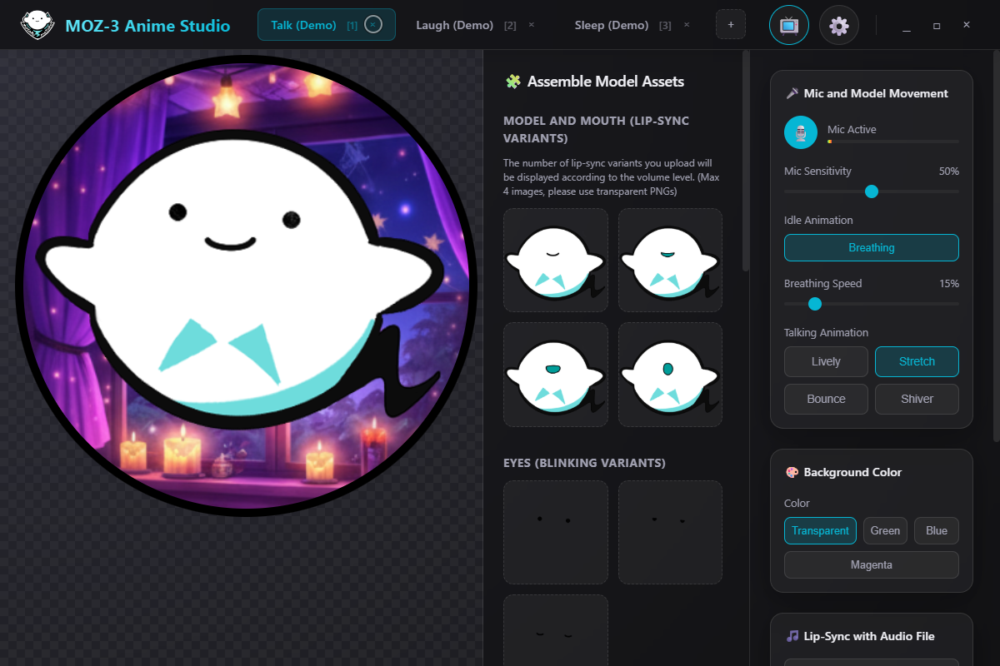
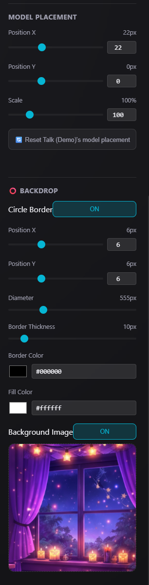

# Avatarian  A MOZ-3 Anime Studio FORK

Avatarian is an interactive, Electron and React-based vTuber/avatar studio application. It provides dynamic lip-sync capabilities, animated expressions, and audio analysis to bring 2D avatars to life for streaming or recording.

This project is a fork. The original source code can be found here:

https://github.com/motaro-aniki/moz-3-anime-studio




Added The following UI Items



Avatarian Contains the following Changes From the Original.
- **Text is now all in English - Translated from Japanese.
- **Stream Deck Support added for switching Tabs See Documenation Below .
- **There is no more auto-switching between tabs by the app as I found that not suitable for my purposes.
- **Background Music Feature has been removed.
- **Added the ability to place the character in a circular border with and optional background image.
- **Fixed Dragging of Window when not maximized on Windows. You can move by title bar though can be a bit finicky (Due to transparent window support)
- **Updated Electron to newest verson that fixes resizing of non maximized window (Due to transparent window support)
- **Added ability to scale model image (including eyes).
- **Removed support for dragging character in editor. Added x,y positional sliders instead as drag and drop was flakey.
- **Redid positioning system to offest characters from the right panel so they maintain position when window is resized.
- **Microphone will default to last one you seleted ( ie Nvidia Broadcast)
- **Defaulted to Mic being active.
- **Reworked lip-syncing to move mouth more accurately with sound.
- **The exit stream mode hover button was taking a bit long to disappear so I decreased it to 1 second.
- **Fixed issue of tabs not getting renumbered when one is deleted.


The Creator's Youtube Channel is here:


Motaro sensei

https://www.youtube.com/channel/UCKetWmeZ8I95zejbTxiNg9Q

A big thank you to Motaro!

I found out about this project from here and originally just wanted to translate to English (I have done a lot more!).

https://www.youtube.com/watch?v=48kUGGBYD2I

## Features

- **Avatar Customization:** Organize your avatar into customizable slots and expressions.
- **Microphone Lip-Sync:** Real-time audio analysis automatically triggers lip-sync and expressions based on your microphone input.
- **Audio File Lip-Sync:** Load custom audio files and have your avatar automatically lip-sync to the playback.
- **Background Support:** Toggle between Transparent, Green, Blue, and Magenta backgrounds for easy chroma-keying in OBS or other broadcasting software.
- **Transform Controls:** Adjust the position, scale, and rotation of individual avatar parts.
- **Calibration:** Calibrate microphone sensitivity and audio thresholds for an accurate lip-sync and tone-detection response.

## Getting Started

### Prerequisites
- Node.js (v18 or newer recommended)
- npm or yarn

### Installation
1. Clone the repository to your local machine.
2. Install the necessary dependencies:
   ```bash
   npm install
   ```

### Running the App
To run the app in development mode using Electron and Vite:
```bash
npm run dev
```

To build for production:
```bash
npm run build
```

## How to Use

1. **Adding Your Avatar:**
   - Use the **Assemble Model Assets Panel** to upload or assign different image parts (e.g., base, eyes, mouth) to your character.
   - Configure different **Characters** or **Expressions** by adding new tabs. (e.g., talking, laughing, sleeping).

2. **Audio & Lip-Sync:**
   - Navigate to the **Settings Panel** to select your audio input device.
   - You can speak into your microphone or upload an audio file. The application will analyze the audio to trigger the appropriate avatar expressions and mouth shapes.
   - Use the **Calibration Modal** if the lip-sync feels too sensitive or not responsive enough.

3. **Backgrounds (OBS / Streaming):**
   - In the Settings Panel, find the **Background Color** section.
   - Select Green, Blue, or Magenta to use chroma key filters in your streaming software (like OBS Studio). Choose Transparent if your capture setup supports an alpha channel directly.

## Stream Deck Integration

Avatarian includes a built-in HTTP API server that allows you to switch expression tabs remotely — perfect for use with an Elgato Stream Deck or any device/tool that can send HTTP requests.

When the app starts, a local API server automatically launches on **port 8769**, bound to `127.0.0.1` (localhost only) for security.

### Endpoints

| Endpoint | Method | Purpose |
|---|---|---|
| `http://127.0.0.1:8769/api/switch/1` | GET | Switch to the tab with keybind **1** |
| `http://127.0.0.1:8769/api/switch/2` | GET | Switch to the tab with keybind **2** |
| `http://127.0.0.1:8769/api/switch/3` | GET | Switch to the tab with keybind **3** |
| ... up to `/api/switch/8` | GET | Supports keybinds **1** through **8** |
| `http://127.0.0.1:8769/api/tabs` | GET | Returns a JSON list of all tabs (id, name, keybind) |

### Example Response — `/api/tabs`
```json
{
  "tabs": [
    { "id": "1", "name": "Talk (Demo)", "keybind": "1" },
    { "id": "2", "name": "Laugh (Demo)", "keybind": "2" },
    { "id": "3", "name": "Sleep (Demo)", "keybind": "3" }
  ]
}
```

### Example Response — `/api/switch/2`
```json
{ "ok": true, "switched": "2" }
```

### Setting Up Your Stream Deck

1. **Using the "Website" action:** Add a "Website" action to a button and set the URL to `http://127.0.0.1:8769/api/switch/1` (change the number for each expression). Uncheck "Access in default browser" if that option is available.
2. **Using the "API Ninja" plugin (recommended):** Install the API Ninja plugin from the Stream Deck Store, add an "API Request" action, set the method to **GET**, and enter the URL for each button.
3. **Any HTTP tool:** Any tool that can make a GET request to a URL will work (curl, Postman, AutoHotkey, Touch Portal, etc.).

### Changing the Port

The API server port is defined as `STREAM_DECK_PORT` at the top of `electron/main.js`. To change it:

1. Open `electron/main.js`
2. Find the line:
   ```js
   const STREAM_DECK_PORT = 8769;
   ```
3. Change `8769` to your desired port number
4. Restart the app
5. Update your Stream Deck button URLs to use the new port

### Security

The API server **only accepts connections from localhost** (`127.0.0.1`). Remote connections are rejected with a `403 Forbidden` response. This means only software running on the same machine as Avatarian can control it.


## License
Same license as original code.
This project is a fork of moz-3-anime-studio, see original repository for licensing.

https://github.com/motaro-aniki/moz-3-anime-studio.